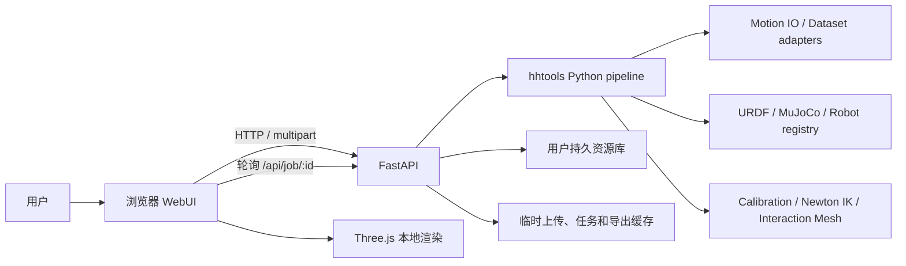
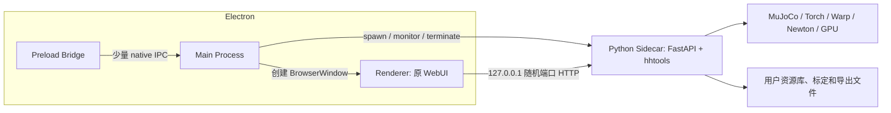

# hhtools WebUI 到 Electron 的等价迁移方案

> 状态：第一版设计稿  
> 范围：不改变现有 UI，不重写算法，仅将当前 WebUI 的功能完整迁移到桌面程序。  
> 盘点基线：`hhtools/web/server.py`、`hhtools/web/static/app.js`、`hhtools/web/static/dataset_viz.js`。

## 1. 结论先行

第一版 Electron 应采用以下结构：

1. **Renderer 保留现有 HTML / CSS / JavaScript / Three.js 页面。**
2. **Python FastAPI 保留为本机 sidecar 服务。** 所有动作加载、机器人解析、标定、Retarget、批处理和数据集分析继续走现有 HTTP API。
3. **Electron Main 只负责桌面生命周期。** 包括启动和关闭 Python、选择空闲端口、创建窗口、记录日志、处理崩溃和后续接入系统文件对话框。
4. **Preload 只暴露少量桌面能力。** 第一版不把 45 个 HTTP API 重写为 Electron IPC。

这样可以把“桌面化”和“界面/算法重构”分开：第一版只验证同一套 UI、同一套 API、同一套计算结果能在 Electron 内完整运行。

## 2. 当前系统结构



当前代码本身已经是适合 Electron sidecar 的形态：后端注释明确为 `single-user, localhost-first`；浏览器负责渲染与交互，Python 负责无法在浏览器内完成的重计算。

### 2.1 数量统计

| 项目 | 数量 | 说明 |
|---|---:|---|
| FastAPI `/api/*` 路由 | **45** | `16 GET + 27 POST + 2 DELETE` |
| 当前 WebUI 实际调用 | **38** | 第一版 Electron 必须保持兼容 |
| 当前 WebUI 未直接调用 | **7** | 保留接口，不列入第一版 UI 验收主路径 |
| 页面路由 | 2 | `GET /`、`GET /index.html`，均返回同一个 UI |
| 长任务状态通道 | 1 | `GET /api/job/{job_id}` 轮询，无 WebSocket |
| 主工作区 | 5 | Motion、Robot / Retarget、Batch、R2R、Dataset |

## 3. API 完整台账

“现用”表示在 `app.js` 或 `dataset_viz.js` 中找到直接调用；“保留”表示后端存在但当前 WebUI 没有直接调用。

### 3.1 系统与能力探测（2）

| 状态 | 方法 | 路径 | 功能 |
|---|---|---|---|
| 现用 | GET | `/api/health` | 检查服务、UI build、静态资源特性及资源目录；页面启动时调用 |
| 保留 | GET | `/api/formats` | 返回支持的文件格式、数据集格式和已注册 loader |

### 3.2 动作资源库与素材（6）

| 状态 | 方法 | 路径 | 功能 |
|---|---|---|---|
| 现用 | GET | `/api/library` | 扫描内置资源与用户动作库，返回目录和 clip 列表 |
| 现用 | POST | `/api/library/link` | 将外部动作目录链接到持久动作库 |
| 保留 | DELETE | `/api/library/link/{folder_label}` | 移除动作库目录链接 |
| 现用 | POST | `/api/motion/load_library` | 后台加载资源库中的动作，返回 `job_id` |
| 现用 | POST | `/api/motion/upload` | 上传动作或目录，持久化到动作库并后台解析 |
| 现用 | GET | `/api/object_glb` | 按 motion token 和 object index 返回场景物体 GLB |

### 3.3 机器人管理（5）

| 状态 | 方法 | 路径 | 功能 |
|---|---|---|---|
| 现用 | GET | `/api/robots` | 返回内置和用户机器人列表、DOF、是否可删除 |
| 现用 | POST | `/api/robot/select` | 加载机器人、编译 MuJoCo、序列化给 Three.js，并后台预热 IK |
| 现用 | POST | `/api/robot/upload` | 上传 URDF 和 meshes，修复路径、生成配置、持久化并加载 |
| 现用 | DELETE | `/api/robot/{name}` | 删除用户注册机器人；内置机器人不可删 |
| 现用 | POST | `/api/robot/fk_preview` | 根据 `joint_q` 计算 FK，返回 link transform、关节世界坐标和离地高度 |

### 3.4 标定与缩放预览（5）

| 状态 | 方法 | 路径 | 功能 |
|---|---|---|---|
| 现用 | GET | `/api/calibration/references` | 返回可用人体参考姿态名称 |
| 现用 | GET | `/api/calibration/status` | 检查机器人与 reference 是否已有标定或 bundled scaler |
| 现用 | POST | `/api/calibration/session` | 创建交互标定会话，返回参考姿态、关节限制和已保存关节值 |
| 现用 | POST | `/api/calibration/save` | 保存 `retarget_calibration_<reference>.yaml` 及派生标定参数 |
| 现用 | POST | `/api/scaled_preview` | 在 IK 前生成缩放骨架和缩放场景预览 |

### 3.5 单条 Retarget、任务与导出（4）

| 状态 | 方法 | 路径 | 功能 |
|---|---|---|---|
| 现用 | POST | `/api/retarget` | 创建单条人体动作到机器人动作的后台 Retarget 任务 |
| 现用 | GET | `/api/job/{job_id}` | 返回统一任务状态、总进度、clip 进度、消息、结果或错误 |
| 现用 | GET | `/api/job/{job_id}/download` | 下载完成后的批处理 ZIP artifact |
| 现用 | GET | `/api/export/{export_token}` | 将单条 Retarget/R2R 结果导出为 CSV、PKL 或带场景的 ZIP |

### 3.6 批量篮子与批处理（5）

| 状态 | 方法 | 路径 | 功能 |
|---|---|---|---|
| 现用 | POST | `/api/basket/upload` | 将外部 clip 上传到会话临时缓存并后台解析 |
| 保留 | GET | `/api/basket` | 读取服务端 basket |
| 保留 | POST | `/api/basket/add` | 向服务端 basket 添加条目 |
| 保留 | POST | `/api/basket/clear` | 清空服务端 basket |
| 现用 | POST | `/api/batch/retarget` | 批量 Retarget，返回逐 clip 进度、失败明细及 ZIP |

当前 WebUI 的 basket 实际保存在 Renderer 的 JavaScript 数组中；后三个服务端 basket 接口没有被当前页面使用。

### 3.7 数据集可视化与分析（10）

| 状态 | 方法 | 路径 | 功能 |
|---|---|---|---|
| 现用 | POST | `/api/dataset/analyze` | 后台扫描、计算特征/embedding、聚类并生成分析结果 |
| 保留 | GET | `/api/dataset/result` | 读取已有分析缓存 |
| 保留 | POST | `/api/dataset/subset` | 服务端计算 weighted farthest-point subset |
| 现用 | GET | `/api/dataset/catalog` | 返回标签、指标、类别和说明元数据 |
| 现用 | POST | `/api/dataset/upload` | 上传/追加文件夹并保留相对路径，形成分析批次 |
| 现用 | POST | `/api/dataset/upload/remove` | 从上传批次中删除一个 folder label |
| 现用 | POST | `/api/dataset/export_manifest` | 导出选中 clip 的 JSON/CSV manifest |
| 现用 | POST | `/api/dataset/export_robot_zip` | 打包选中机器人轨迹及 terrain/object sidecar |
| 现用 | POST | `/api/dataset/preview_robot` | 后台加载机器人轨迹，生成 Three.js 预览数据 |
| 现用 | GET | `/api/dataset/scene_glb` | 返回数据集预览所需物体 mesh GLB |

当前前端没有调用 `/api/dataset/subset`，而是在 `dataset_viz.js` 内执行 `globalWeightedFps()`。这属于迁移时必须保留的 Renderer 逻辑。

### 3.8 Robot-to-Robot（8）

| 状态 | 方法 | 路径 | 功能 |
|---|---|---|---|
| 现用 | POST | `/api/r2r/source/upload` | 上传源机器人轨迹并后台做 FK/场景解析 |
| 现用 | GET | `/api/r2r/scene_glb` | 返回 R2R 源/目标场景的 GLB |
| 现用 | POST | `/api/r2r/calibration/session` | 创建 source robot 到 target robot 的交互标定会话 |
| 现用 | POST | `/api/r2r/calibration/save` | 保存目标机器人针对源机器人的 R2R 标定 |
| 现用 | GET | `/api/r2r/calibration/status` | 检查目标机器人是否已有对应源机器人的标定 |
| 现用 | POST | `/api/r2r/retarget` | 创建单条 Robot-to-Robot Retarget 任务 |
| 现用 | POST | `/api/r2r/basket/upload` | 上传并解析 R2R 批量轨迹 |
| 现用 | POST | `/api/r2r/batch/retarget` | 批量 Robot-to-Robot Retarget 并生成 ZIP |

## 4. WebUI 与后台功能对应

### 4.1 Motion 工作区

**前端功能**

- 三种动作导入 profile：mimic、intermimic、meshmimic/相关目录结构。
- 浏览、搜索、加载动作资源库；链接外部目录。
- Three.js 播放人体骨架、网格、蒙皮、场景地形和物体。
- 播放/暂停、时间轴、循环、速度、相机复位及显示层开关。
- 将动作加入批量 basket。

**后台职责**

- 识别文件和数据集 adapter，加载 motion，生成序列化骨架/网格/场景。
- 维护 `motion_token -> Motion` 的会话缓存。
- 将浏览器上传的目录链接或复制到用户动作库。

**主要 API**：`library`、`library/link`、`motion/load_library`、`motion/upload`、`object_glb`、`job`。

### 4.2 Robot / Retarget 工作区

**前端功能**

- 选择内置机器人，或分两步上传 URDF 与 meshes。
- 删除用户机器人、展示机器人元数据。
- 首次标定：参考姿态选择、关节拾取/拖动、slider 编辑、归零、恢复与保存。
- IK 前 scaled skeleton/scene 预览。
- 单条 Retarget、进度展示、结果播放及 CSV/PKL/ZIP 导出。
- 导出 FPS、时间裁剪、CSV header 等选项。

**后台职责**

- URDF 规范化、mesh 路径修复、MuJoCo 编译、机器人序列化与 IK 预热。
- FK、标定派生参数、Newton IK 或 Interaction Mesh 求解。
- 缓存 Retarget 结果，按用户导出参数即时生成文件。

**主要 API**：`robots`、`robot/*`、`calibration/*`、`scaled_preview`、`retarget`、`job`、`export`。

### 4.3 Batch 工作区

**前端功能**

- basket 增删、外部 clip 上传、按 reference 显示标定状态。
- 设置 backend、batch size、Retarget FPS、导出 FPS、时间范围和格式。
- 展示总体进度、当前 clip 进度、失败阶段、原因和日志路径。
- 完成后自动下载 ZIP。

**后台职责**

- 解析外部 clip 到临时会话缓存。
- 批量调度加载、求解和导出；汇总成功项与失败项；生成 ZIP artifact。

**主要 API**：`basket/upload`、`batch/retarget`、`job`、`job/.../download`。

### 4.4 Robot-to-Robot 工作区

**前端功能**

- 选择并加载源机器人和目标机器人。
- 上传源机器人轨迹，播放源/目标 robot、skeleton 和 environment 图层。
- source 到 target 的交互标定与保存。
- 单条 R2R Retarget、结果播放、导出。
- R2R 批量 basket、处理进度和 ZIP 下载。

**后台职责**

- 读取现有机器人轨迹并做 FK/场景解析。
- 建立 source-target 标定文件。
- 执行单条或批量 R2R 求解与导出。

**主要 API**：全部 `/api/r2r/*`，并复用 `robots`、`robot/select`、`robot/fk_preview`、`job`、`export`。

### 4.5 Dataset 工作区

**前端功能**

- 文件夹拖放、追加批次、移除文件夹和本地源路径提示。
- 标签筛选、指标直方图、brush、语义散点图、平移/缩放和详情选择。
- 在 Renderer 内计算 weighted FPS 推荐子集。
- 人体 clip 加入 Retarget basket；机器人 clip 在 Three.js 中预览。
- 导出 manifest 或机器人轨迹 ZIP。

**后台职责**

- 扫描人体/机器人数据，计算特征、embedding、标签、聚类和 summary。
- 解析机器人轨迹预览，安全读取场景 mesh。
- 将临时上传路径映射为用户真实源路径并生成导出文件。

**主要 API**：`dataset/catalog`、`dataset/upload*`、`dataset/analyze`、`dataset/preview_robot`、`dataset/scene_glb`、`dataset/export_*`、`job`。

## 5. 共享交互机制

### 5.1 长任务协议

动作加载、数据集分析、单条 Retarget、批量 Retarget、R2R 和机器人轨迹预览都采用同一模式：

1. Renderer 发起 `POST` 或 multipart upload。
2. FastAPI 创建 `Job`，启动 Python `threading.Thread`，立即返回 `job_id`。
3. Renderer 每约 400-700 ms 请求 `GET /api/job/{job_id}`。
4. 后端返回：`status`、`progress`、`clip_progress`、`message`、`result`、`error`。
5. 完成后 Renderer 装载轨迹/场景，或访问 download/export API。

第一版 Electron 必须保持这个协议，不需要立即改成 WebSocket 或 IPC event。

### 5.2 状态与文件生命周期

| 类型 | 当前位置 | 生命周期 | Electron 第一版处理 |
|---|---|---|---|
| Motion、Job、R2R source、preview token | Python `SessionState` 内存 | 服务进程退出即失效 | 保持不变 |
| 上传缓存、导出缓存 | 系统临时目录 `hhtools_web_*` | 会话级 | 保持不变，退出时尽量清理 |
| 用户机器人 | `platformdirs` 用户配置目录 | 持久 | 保持路径兼容 |
| 用户动作链接/素材库 | `~/.config/hhtools/motions` 等用户目录 | 持久 | 保持路径兼容 |
| 标定 YAML | 机器人 URDF 同目录 | 持久 | 保持路径和命名兼容 |
| Panel 宽度、隐藏状态、教程状态 | Renderer `localStorage` | 持久 | Electron origin 固定后继续复用 |
| Electron 窗口大小/位置 | 当前不存在 | 持久 | 新增到 Electron `userData` |

## 6. Electron 第一版目标与非目标

### 6.1 目标

- Windows 上双击启动一个桌面窗口。
- 视觉和布局与当前 WebUI 一致。
- 38 个现用 API 的行为、请求字段和返回结构保持不变。
- 五个工作区的完整主流程都能执行。
- Electron 退出时 Python 子进程不会残留。
- 服务启动失败、依赖缺失、端口冲突和任务崩溃都有可诊断日志。

### 6.2 非目标

- 不在第一版重写 Vue/React 组件。
- 不把 FastAPI 路由批量改成 IPC handler。
- 不改变当前左右栏、画布、按钮、对话框和操作流程。
- 不在第一版引入 WebSocket、任务队列或多用户能力。
- 不保证第一版就是完全免 Python/CUDA 环境的单文件绿色安装包。

## 7. 推荐 Electron 架构



### 7.1 Electron Main Process

职责：

- 使用 single-instance lock，避免两个窗口争用同一组临时状态。
- 选择空闲的 loopback 端口。
- 生成本次启动的随机 session secret。
- 启动 Python sidecar，并传入 host、port、source root、save dir、cache dir。
- 等待 `/api/health` 成功后再显示主窗口。
- 保存窗口尺寸/位置；处理最小化、关闭和重新启动。
- 收集 sidecar stdout/stderr 到桌面日志目录。
- Electron 退出时先优雅停止，超时后清理整个子进程树。
- 禁止 Renderer 任意跳转；外部链接交给系统浏览器。

### 7.2 Preload

开启：

- `contextIsolation: true`
- `nodeIntegration: false`
- `sandbox: true`（如 Three.js 和现有资源加载验证无冲突）

第一版只建议暴露：

- `getRuntimeInfo()`：版本、平台、后端地址。
- `openExternal(url)`：受限外链。
- `showItemInFolder(path)`：导出后定位文件，可在第二阶段接入。
- `chooseDirectory()` / `chooseFiles()`：第二阶段替换浏览器 file input。

### 7.3 Renderer

第一版直接复用：

- `index.html`
- `style.css`
- `app.js`
- `dataset_viz.js`
- `tutorial.js`
- vendored Three.js 资源

推荐让 BrowserWindow 加载 `http://127.0.0.1:<port>/`，而不是 `file://index.html`。这样现有相对 `/api/...` 路径、multipart 上传、GLB 请求、下载和同源策略都不需要修改。

### 7.4 Python Sidecar

保留当前 `create_app()` 和 `hhtools web` 能力，但增加一个专用于桌面启动的入口，例如：

```text
python -m hhtools.desktop_sidecar \
  --host 127.0.0.1 \
  --port <ephemeral-port> \
  --source-root <path> \
  --save-dir <path> \
  --session-secret <secret>
```

该入口不自动打开系统浏览器，由 Electron 负责窗口。

### 7.5 SidecarSupervisor

不要让 `BrowserWindow` 或零散 IPC handler 直接持有 `ChildProcess`。Electron Main 内应有唯一的 `SidecarSupervisor`，集中管理 Python 的启动、就绪、日志、退出和重启。

| 状态 | 含义 | 允许的下一状态 |
|---|---|---|
| `stopped` | 没有 Python 进程 | `starting` |
| `starting` | 已开始创建进程，尚未通过健康检查 | `ready`、`stopping`、`crashed` |
| `ready` | `/api/health` 已确认服务可用 | `stopping`、`crashed` |
| `stopping` | 用户退出或应用重启导致的预期关闭 | `stopped` |
| `crashed` | 非预期退出或启动失败 | `starting`、`stopped` |

必须区分两个就绪信号：

1. **Process spawned**：获得 PID，只说明 Python 进程已经创建。
2. **Backend ready**：`/api/health` 返回成功，才允许 Renderer 发起业务请求。

`SidecarSupervisor` 的第一版职责：

- 保证同一时间只有一个启动 Promise，避免双击或窗口重载重复拉起 Python。
- 使用受控环境变量白名单，并单独注入端口、session secret、用户资源目录和日志目录。
- 以 UTF-8 解码 stdout/stderr，写入按启动会话划分的日志。
- 对外提供 `onStateChange`、`onExit`、`onCrash`，但不把原始 `ChildProcess` 暴露给 Renderer。
- 用户关闭时先进入 `stopping`，等待 3-5 秒；超时后清理整个进程树。
- 使用启动 generation/session id 忽略旧进程迟到的 exit 事件，避免误伤新进程。
- 非预期退出时保留日志并提供显式重启入口；第一版不做无限自动重启。

### 7.6 AppLifecycle

Electron Main 采用单向生命周期，避免启动和退出逻辑散落在事件回调中：

| 阶段 | 阻塞内容 | 允许延后内容 |
|---|---|---|
| `Starting` | 单实例、用户目录、日志、运行时配置 | 更新检查、资源统计 |
| `BackendStarting` | Python 解析、spawn、健康检查 | 非当前工作区的预扫描 |
| `Ready` | 主窗口可以加载业务页面 | 诊断汇总、更新检查 |
| `AfterWindowOpen` | 窗口已显示 | 空闲任务和可选能力探测 |
| `ShuttingDown` | 保存窗口状态、停止 sidecar、落盘日志 | 不再启动新任务 |

生命周期只能向前推进。sidecar 在运行中崩溃属于 runtime 状态变化，不应让应用生命周期退回 `BackendStarting`；恢复应由 `SidecarSupervisor.restart()` 显式执行。

Main 提供轻量的 shutdown joiner：窗口状态、sidecar 和日志服务可以注册带名称的异步收尾任务。退出时等待所有 joiner settle，记录失败但仍保证最终退出。

### 7.7 MainWindow 与窗口状态

- 创建窗口时使用 `show: false`，同时等待 backend ready 和 Electron `ready-to-show`，两个条件都满足后再显示，减少白屏和闪烁。
- 设置稳定的最小宽高，避免左右栏、Three.js 画布和底部播放条在过小窗口中互相覆盖。
- 只保存普通状态下的 `x`、`y`、`width`、`height` 以及 `maximized`；不持久化 minimized 状态。
- 最大化时保存 normal bounds，以便下次恢复到正确尺寸。
- 恢复前校验窗口是否仍与当前任一显示器相交；外接屏移除后回退到主显示器居中。
- 第二次启动只聚焦并恢复已有窗口，不再创建 sidecar。第一版使用 Electron `requestSingleInstanceLock()` 即可。
- 监听 `render-process-gone`、`unresponsive` 和 `did-fail-load`，将窗口错误与 Python sidecar 错误分开记录。

## 8. HTTP 与 IPC 的边界

| 能力 | 通道 | 原因 |
|---|---|---|
| 动作、机器人、标定、Retarget、Dataset | HTTP API | 已有稳定实现，保留协议风险最低 |
| `Job` 进度 | HTTP 轮询 | 当前行为成熟，第一版无需引入新通道 |
| GLB、轨迹 JSON、ZIP、CSV/PKL 下载 | HTTP response | 可继续流式/二进制传输，不适合 IPC JSON |
| 选择文件/目录 | 第一版沿用 HTML input；后续 IPC | 先保证 UI 等价，再接入原生 dialog |
| 打开外链、显示文件位置 | IPC | 属于操作系统能力 |
| 应用更新、窗口控制、日志定位 | IPC | 只应由 Main 执行 |

不要建立一套与 FastAPI 一一对应的 45 个 IPC handler。那会产生两套传输协议、两套错误处理和两套测试。

### 8.1 Native bridge 契约

Preload 只向 `window.hhtoolsDesktop` 暴露具名方法，不暴露通用 `send(channel)`、原始 `ipcRenderer`、Node `process` 或文件系统。

所有 Electron IPC channel 使用 `hhtools:` 前缀。Main 每次处理请求时同时校验：

- channel 属于显式允许列表；
- `event.sender` 是当前主窗口的 `webContents`；
- `event.senderFrame` 来自主 frame；
- sender URL 的 origin 精确等于本次启动的 `http://127.0.0.1:<port>`；
- 参数符合共享 TypeScript contract/schema。

业务错误返回稳定的结构化错误码和用户可读消息，不把 Main 堆栈直接传入页面。事件监听必须返回 dispose/unsubscribe 方法，窗口销毁时统一解除。

## 9. 启动、运行与退出流程

### 9.1 启动

1. Electron 调用 `requestSingleInstanceLock()`；第二实例只聚焦现有窗口后退出。
2. 进入 `Starting`，创建日志和用户数据目录，读取并校验窗口状态。
3. 检测 Python runtime、hhtools 包和必要依赖；可选 GPU 能力可在窗口打开后继续探测。
4. 选择随机 loopback 端口，生成 session secret，并以受控环境启动 sidecar。
5. `SidecarSupervisor` 记录 spawned/PID，再以退避间隔检查 `/api/health`，总超时建议 30-60 秒。
6. backend ready 后加载 `http://127.0.0.1:<port>/`；同时等待 `ready-to-show` 后显示窗口。
7. 进入 `AfterWindowOpen`，再执行更新检查、诊断汇总等非首屏任务。
8. 失败时显示诊断页：启动阶段、命令摘要、日志文件、Python 版本和缺失依赖，但不把堆栈直接塞进业务 UI。

### 9.2 运行

- Main 监听 sidecar 退出事件；非用户退出时显示“后端已停止”的恢复入口。
- Main 维护 sidecar runtime 状态，避免把预期 shutdown 误报为 crash。
- Renderer 所有业务请求继续使用相对 `/api`。
- 长任务继续轮询；Electron 窗口刷新会丢失当前内存 token，这与现有浏览器刷新行为一致。
- sidecar 重启后旧 token 全部失效；Renderer 应进入可恢复错误状态，不自动重复提交计算任务。

### 9.3 退出

1. 生命周期进入 `ShuttingDown`，拒绝启动新 sidecar 和新的桌面操作。
2. 保存并校验窗口 normal bounds 和 maximized 状态。
3. 将 sidecar 标记为预期退出，请求优雅停止或发送终止信号。
4. shutdown joiner 最多等待 3-5 秒，期间刷新状态文件和日志。
5. 超时后在 Windows 下清理整个进程树，确保 Warp/Newton 子进程不残留。
6. 关闭日志句柄并退出 Electron。

## 10. 本地安全基线

虽然服务只在本机运行，Electron 仍不应假设 localhost 天然可信：

- FastAPI 只绑定 `127.0.0.1`，禁止 `0.0.0.0`。
- 使用随机端口，避免固定端口冲突。
- Main 为每次启动生成随机 secret；Renderer 请求通过 header 携带，后端校验。
- 校验 `Host` 和 `Origin`，origin 必须精确匹配本次随机端口，拒绝其它网页调用本机计算 API。
- 保持 Electron `webSecurity` 开启。
- 设置 CSP，限制脚本、资源和连接来源。
- Renderer 启用 `sandbox: true`、`contextIsolation: true`、`nodeIntegration: false`。
- Main 和 Preload 都校验 `hhtools:` IPC allowlist，Main 额外校验 sender、origin 和 main frame。
- Electron permission request/check 默认拒绝，仅在明确需要时逐项开放。
- 拒绝 `window.open` 和未授权导航；外链使用 `shell.openExternal` 且验证 `http/https`。
- 文件操作继续依赖后端现有 allowed root 和路径规范化检查。

安全 header 会涉及 API wrapper 的小范围内部修改，但不改变 UI 与业务操作。

## 11. 开发目录建议

```text
desktop/
  package.json
  tsconfig.json
  electron.vite.config.ts
  src/
    main/
      index.ts
      app-lifecycle.ts
      main-window.ts
      sidecar-supervisor.ts
      runtime-resolver.ts
      window-state-store.ts
      ipc/
        register-desktop-handlers.ts
        validate-ipc-sender.ts
      security/
        configure-session.ts
    preload/
      index.ts
    shared/
      desktop-api.ts
      runtime-state.ts
    renderer/
      README.md              # 第一版说明：实际页面由 FastAPI 提供
hhtools/
  desktop_sidecar.py         # 无浏览器自动打开的 uvicorn 入口
  web/
    server.py                # 现有 45 个 API，第一版保持契约
    static/                  # 原 UI 原样复用
tests/
  desktop/
  web/
```

Electron 工程推荐 TypeScript；构建可选 `electron-vite`。这不要求把现有 Renderer 改成 Vue，`electron-vite` 只负责 Main/Preload 的开发和打包。

## 12. Python runtime 与打包策略

`web` 和 `retarget` 依赖中包含 FastAPI、MuJoCo、SMPL-X、Torch、OSQP、Warp 和 Newton。完全打成一个小型单文件安装包并不现实，尤其还涉及 CUDA/GPU 版本匹配。

建议分两步：

### 12.1 内部 Alpha

- Electron 安装包只包含桌面壳。
- 启动时检测仓库 `.venv`、`uv` 或已安装的 hhtools Python 环境。
- 设置页/诊断页展示当前 runtime 路径和依赖检测结果。
- 适合快速验证 UI 等价、生命周期和五条主流程。

### 12.2 可分发版本

- Electron installer + 受控 Python runtime/sidecar。
- CPU 基础能力与 GPU Retarget 依赖分层安装。
- Newton/CUDA 采用安装器检测或独立 runtime manager，不强行塞入 ASAR。
- 静态资源放 `resources`，Python runtime 使用 `extraResources`，不要放入压缩 ASAR。
- 每个 OS 单独构建和签名，不交叉打包 GPU 运行时。

### 12.3 Electron 壳的构建约束

- Electron 使用精确版本和 lockfile 固定，不直接照搬其它项目的 Electron 版本。
- 第一版可采用 `electron-vite` 编译 Main/Preload，使用 `electron-builder` 生成 Windows 安装包；不要同时维护两套打包系统。
- JavaScript 壳可以进入 ASAR；Python runtime、模型、CUDA/Newton 依赖和需要直接访问的二进制资源放在 `extraResources` 或独立 runtime 目录。
- CI 对下载的 Electron、Python runtime 和模型包进行 checksum 校验。
- 测试版与正式版使用不同的 application id、更新 channel 和用户数据目录，避免相互覆盖。
- 签名、自动更新和回滚放在等价迁移通过之后；内部 Alpha 先保证可重复构建和完整卸载。

## 13. 迁移阶段

### Phase 0：冻结等价基线

- 固定当前 UI build 与 45 个 API 路由清单。
- 为桌面、常见分辨率和关键弹层保存截图。
- 准备最小测试素材：动作、URDF+meshes、标定、单条/批量 R2R、人体/机器人数据集。
- 记录 38 个现用接口的请求和关键返回字段。

**完成条件**：能明确判断 Electron 与当前浏览器版本是否一致。

### Phase 1：Electron 壳 + 原 FastAPI

- 建立 Main/Preload 工程。
- Main 启动 sidecar，健康检查后加载 localhost 页面。
- 完成日志、随机端口、单实例和退出清理。
- 暂时沿用浏览器 file input 和下载行为。

**完成条件**：不修改页面布局即可跑通五个工作区。

### Phase 2：桌面体验补齐

- 原生文件/目录选择器。
- 导出保存对话框和“在文件夹中显示”。
- 后端崩溃恢复、依赖诊断和 runtime 设置。
- session secret、Origin/Host 校验和 CSP。

**完成条件**：用户不需要终端即可完成日常操作和诊断。

### Phase 3：安装、更新与发布

- Windows installer、版本号、图标、签名和自动更新。
- Python/GPU runtime 检测与安装说明。
- 正式版、测试版 channel 隔离。
- 升级失败回滚和用户数据兼容测试。

**完成条件**：可重复安装、升级、卸载，用户资源库和标定不丢失。

### Phase 4：可选重构

只有等价迁移稳定后，再讨论：

- 将 5000+ 行 `app.js` 拆成模块或组件。
- 引入 Vue/React 状态管理。
- 将任务轮询升级为 SSE/WebSocket。
- 清理 7 个未调用 API 或恢复对应 UI。

这些不属于第一版 Electron 的阻塞项。

## 14. 等价验收清单

### 14.1 UI 与交互

- 左栏、Three.js 中央画布、右栏、底部播放条的位置和样式一致。
- 左右栏可折叠、拖动宽度并恢复；localStorage 状态可保留。
- 相机、时间轴、速度、循环、图层显示和教程行为一致。
- Electron 不新增影响业务区域尺寸的系统工具栏。

### 14.2 功能主路径

- Motion：资源库、目录链接、上传、加载、场景 GLB、播放。
- Robot：选择、上传、删除、预热、显示。
- Calibration：状态、会话、FK 拖动、保存、scaled preview。
- Retarget：单条任务、进度、播放、CSV/PKL/ZIP 导出。
- Batch：上传、basket、标定检查、双层进度、失败明细、ZIP。
- R2R：源/目标机器人、源轨迹、标定、单条/批量、导出。
- Dataset：上传/追加/移除、分析、筛选、散点、前端 subset、预览和导出。

### 14.3 生命周期与异常

- 固定端口被占用时仍能启动。
- 后端启动超时有明确诊断。
- 缺少 Newton、GPU 或模型权重时保留现有错误含义。
- 关闭窗口后不残留 Python/Warp/Newton 进程。
- 重启后用户机器人、动作链接和标定仍存在。
- 刷新/后端重启导致 token 失效时，提示用户重新加载素材。

## 15. 测试建议

| 层级 | 测试内容 |
|---|---|
| Python route smoke | health、library、robots、上传、标定、job 状态和下载 |
| API contract | 38 个现用接口的 method、path、请求字段和关键返回字段快照 |
| Job lifecycle | `running -> done`、`running -> error`、批量 progress/clip_progress |
| Electron integration | sidecar 启停、随机端口、崩溃恢复、退出清理、日志路径 |
| SidecarSupervisor unit | 状态单向转换、重复 start 合并、spawn 后未 ready、启动超时、预期退出与 crash 分类 |
| Lifecycle unit | shutdown joiner settle、超时强杀、退出期间拒绝重启 |
| IPC security | channel allowlist、错误 sender/origin/frame 拒绝、参数 schema 校验 |
| Window state | 普通/最大化恢复、忽略最小化、显示器移除后回退、第二实例聚焦 |
| E2E | 用 Playwright 驱动 Electron，覆盖五个工作区主路径 |
| Visual regression | 当前浏览器截图与 Electron 截图对比，确认 UI 未改变 |
| Packaging smoke | 干净 Windows 用户环境安装、启动、升级、卸载和数据保留 |

当前 `tests/web` 主要覆盖导出 bundle、R2R/scaled overlay 等计算细节，尚未形成完整 API route contract 测试。Phase 0 应优先补这一层，避免迁移时只能靠手工点击判断回归。

## 16. 风险与决策

| 风险 | 影响 | 第一版决策 |
|---|---|---|
| 将 45 个 API 改成 IPC | 工作量与回归面翻倍 | 不做，业务继续 HTTP |
| `file://` 加载页面 | 相对 API、下载和同源行为都需改 | 加载 localhost 页面 |
| Python/GPU 一次性完全打包 | Torch/Newton/CUDA/MuJoCo 兼容风险高 | Alpha 先复用受控 Python 环境 |
| Electron 刷新导致 token 丢失 | 当前 SessionState 是进程内存 | 保持现状并提示重新加载，后续再做会话恢复 |
| Renderer 仍是大文件 | 可维护性一般 | 不与桌面化同时重构 |
| 后台线程无法取消 | 关闭/重启时可能拖延 | Main 做超时和进程树清理，后续再加任务取消 |
| localhost 被其它网页调用 | 本机文件/计算接口存在风险 | 随机 secret + Origin/Host 校验 |
| 将 spawn 误认为服务就绪 | 页面过早请求导致启动期随机失败 | 分离 process spawned 与 backend ready |
| sidecar 崩溃后无限重启 | 反复拉起 GPU/Python，掩盖真实错误 | 第一版只提供有限或显式重启 |
| 窗口状态来自已移除显示器 | 应用启动后看似“没有窗口” | 恢复前校验显示器并回退到主屏 |
| Renderer 获得通用 IPC/Node 能力 | 页面漏洞可扩大为本地代码执行 | 仅暴露具名 preload API，双端校验 |
| 完整继承父进程环境 | 密钥泄漏或 Python 行为受污染 | sidecar 使用环境变量白名单 |

## 17. 第一轮实施任务

1. 新建 `desktop/`，建立 Main、Preload、shared contracts 和构建配置。
2. 新建不自动打开浏览器的 Python sidecar CLI。
3. 实现 `AppLifecycle` 和 `SidecarSupervisor` 状态机，不先接业务页面。
4. 实现受控环境、随机端口、双阶段 readiness、UTF-8 日志和进程树清理。
5. 实现单实例聚焦、隐藏窗口、窗口状态保存及多显示器校验。
6. 让 BrowserWindow 直接加载当前 FastAPI 页面，并阻止未授权导航和新窗口。
7. 加入最小 session secret、Host/Origin 校验和 `hhtools:` IPC 双端校验，但不改变 UI。
8. 建立 38 个现用接口的 contract 清单和 smoke tests。
9. 补 SidecarSupervisor、生命周期、IPC 安全和窗口状态单元测试。
10. 用最小素材跑通 Motion -> Robot -> Calibration -> Retarget -> Export。
11. 再依次验证 Batch、R2R、Dataset，最后做截图回归。

第一版成功的标准不是“看起来像桌面软件”，而是：**同一套 UI 在 Electron 中稳定启动，现有五个工作区和 38 个实际 API 完整等价，且应用退出后不留下后台进程。**

## 18. VS Code 架构审阅后的取舍

参考基线为本地 Code OSS `1.135.0` / Electron `42.8.1`。这里借鉴的是边界和生命周期原则，不继承其产品规模、版本选择或构建系统。

| VS Code 做法 | hhtools 决策 | 原因 |
|---|---|---|
| `base / platform / workbench / code` 分层 | 轻量采用 | 保持 Main、运行时监管、Preload、Renderer 和 Python 业务边界清楚 |
| `Starting / Ready / AfterWindowOpen / Eventually` | 简化采用 | 控制首屏阻塞，把非关键工作延后 |
| Utility/Shared Process 统一监管 | 将思想用于 `SidecarSupervisor` | Python 是独立运行时，需要 PID、日志、ready、crash 和退出管理 |
| Preload 最小暴露、IPC 双端校验 | 采用 | 避免 localhost 页面获得通用桌面权限 |
| 窗口 normal bounds 保存和显示器校验 | 采用 | 防止最大化、最小化和拔掉外接屏后的恢复问题 |
| Disposable 和 shutdown joiner | 轻量采用 | 用简单 disposer/joiner 管理监听器、日志和异步收尾 |
| 自定义 Node IPC 单实例与 CLI 转发 | 不采用 | hhtools 第一版单窗口，Electron 内置 single-instance lock 足够 |
| DI 容器、ProxyChannel RPC | 不采用 | 业务已有 HTTP API，再造 RPC 会产生第二套协议 |
| Shared Process、Extension Host、Contribution Registry | 不采用 | 第一版没有插件、多窗口共享服务或动态贡献需求 |
| 自定义 Gulp、制品源、签名和更新流水线 | 不采用 | 使用常规 Electron 工具链，降低维护成本 |
| 大规模遥测和崩溃上报体系 | 暂不采用 | Alpha 先依靠本地结构化日志和可导出的诊断包 |

最终原则是：**学习 VS Code 如何划清边界，而不是复制 VS Code 的体量。**

## 19. 实施状态（2026-08-24）

已完成第一轮等价迁移：

- 新增 `desktop/` Electron Main、Preload 和 shared contracts，现有 WebUI 未改版。
- 新增受保护的 `hhtools.cli.desktop_sidecar`，浏览器入口 `hhtools web` 保持原行为。
- 完成随机端口、逐次启动 secret、健康检查、受控环境变量和完整进程树清理。
- 完成 `AppLifecycle`、`SidecarSupervisor`、单实例、窗口状态与多显示器回退。
- 完成具名 Preload API、IPC sender/origin/main-frame 校验和 Electron 权限默认拒绝。
- 完成 TypeScript 单元测试、Python sidecar 安全测试和真实 Electron Playwright E2E。
- Electron 窗口已验证原 5 个工作区及 Three.js 画布；关窗后无 Electron/Python 残留。

仍属于后续发布阶段：

- 将 Python、Torch、Newton、CUDA/MuJoCo 等运行时打入可独立分发的安装包。
- 正式代码签名、自动更新、测试/正式 channel 和升级失败回滚。
- 原生文件对话框及“在文件夹中显示”等桌面体验增强。
